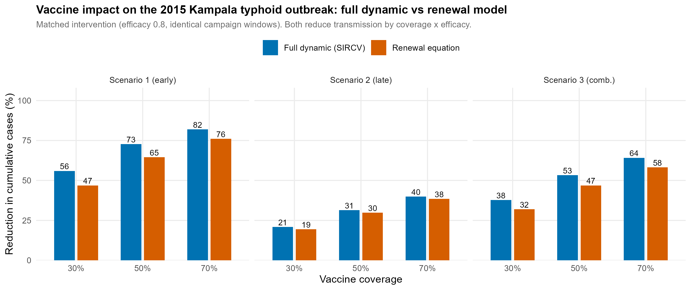
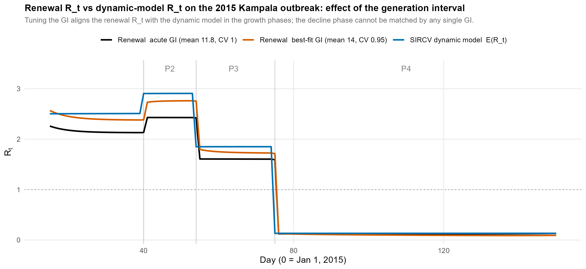

## Objective

Does the renewal-equation model reproduce the vaccine-impact estimates of a fully mechanistic
compartmental model when both are applied to the **same** outbreak under the **same** intervention?
We test this on the 2015 Kampala typhoid outbreak — our **Kabwama 2017** anchor (≈10,000 suspected
cases) — which was independently modelled by Lee et al. (*PLOS NTD* 2025,
doi:10.1371/journal.pntd.0013566; repo `modeling-computation/Typhoid_modeling`).

All code and outputs are in `revision/seir_comparison/`:
`kampala_seir_vs_renewal.R`, `gi_tuning.R`, `comparison_results.csv`,
`fig_seir_vs_renewal.png`, `fig_gi_tuning.png`, and the published scenario curves
(`published_seir_sc*.csv`, exported from the paper's `Vaccine scenarios.xlsx`).

> **Naming.** The published dynamic model is a deterministic **SIRCV** system (susceptible,
> infectious, recovered, chronic-carrier, vaccinated) — there is **no exposed compartment**, so it is
> not an SEIR model. We use *SIRCV* throughout.

## The full dynamic model (SIRCV), re-implemented and validated

With $N=S+I+R+C+V$ and $\lambda(t)=\beta(t)\,[I(t)+\gamma C(t)]/N(t)$, the published system is

$$
\begin{aligned}
\dot S &= bN-\lambda S-\phi(t)+\omega_v V+\omega R-\mu S, &
\dot I &= \lambda S-(\delta+\mu)I, \\
\dot R &= \delta(1-\theta-\alpha)I-(\omega+\mu)R, &
\dot C &= \delta\theta I-\mu C, \qquad
\dot V = \phi(t)-(\omega_v+\mu)V,
\end{aligned}
$$

with **direct transmission only** (carriers $C$ contribute at relative infectiousness $\gamma$).
Table-1 parameters: infectious period $1/\delta=11.8$ d, carrier fraction $\theta=0.029$,
$\gamma=0.0009$ (calibrated so carriers supply 10% of $R_0$), disease mortality $\alpha=0.025$,
reporting $f=0.2$, $N_0=1.4\times10^6$, $R_0=2.49$, efficacy $v=0.8$, $I(0)=1$. Transmission is
piecewise-constant across four outbreak phases, with fitted values (Table 4)

| | P1 | P2 | P3 | P4 |
|---|---|---|---|---|
| $\beta_i$ | 0.19 | 0.22 | 0.14 | 0.01 |
| $E(R_t)$ | 2.49 | 2.87 | 1.86 | 0.15 |

Reported incidence is $f\,I(t)$. Vaccination transfers $\phi=\kappa v N_0/T$ from S to V over the
campaign window (coverage $\kappa\in\{0.3,0.5,0.7\}$).

We re-implemented this from scratch (RK4, sub-daily). It is a **corrective re-implementation, not a
literal transcription**: the printed susceptible equation omits the recovered-waning inflow, and we
restore the mass-conserving $+\omega R$ term (biologically necessary, negligible here as
$\omega=1/730\,\text{d}^{-1}$; a literal version without it agrees to ~6 cases). Validation:

- The early days match the saved curve to four digits (day 1–3 reported incidence
  0.2000 / 0.2222 / 0.2469 vs 0.2000 / 0.2218 / 0.2460), but the fit is **not exact overall**: with
  the rounded Table-4 $\beta$'s the re-simulated cumulative baseline is **8,013 vs 8,741 (−729)**, the
  daily peak is **~33 cases/day low** (283.6 vs 316.4), and while **84%** of the cumulative shortfall
  is in the long P4 tail, **16% (119 cases) is already present before P4** — not purely a tail
  artefact. Curve-calibrating the four $\beta$'s to the saved baseline closes the gap and implies the
  printed $\beta_4=0.01$ is slightly under the value that generated the workbook curve; we retain the
  printed values and validate on reduction rates instead.
- The **reduction rates reproduce the paper to within 1.6 percentage points** (max 1.5, at late-70%).
  We do **not** claim to reproduce absolute averted cases: multiplying a percentage reduction by the
  shared baseline of 8,741 returns the published averted (7,172 / 3,618 / 5,734) *by construction*, a
  definitional identity, not independent validation.

The **attack rate is ≈0.24%**: the epidemic produces ≈**3,400 cumulative new infections** (the summed
new-infection flow $\sum_t\lambda_tS_t$). Note the saved 8,741 is $\sum_t fI(t)$ — a *stock* of
reported infectious person-days, not incident cases, so $8{,}741/f$ counts person-days
(≈40,000), not infections. Susceptible depletion is therefore utterly negligible and the epidemic's
decline is driven entirely by the fitted fall in $\beta(t)$ (control measures) — the low-depletion
regime in which the renewal model is expected to be accurate.

## The renewal model on the same outbreak

We applied our renewal machinery to the **same** outbreak. $R_t$ is reconstructed from the SIRCV
baseline **new-infection flow** $J_t=\lambda_t S_t$ (not the reported prevalence stock $f\,I(t)$,
which is a convolution of incidence with the infectious-period survival and would imply the wrong
kernel). The generation interval is the model's **intrinsic acute GI**: for this SIR structure (no
latent period, constant infectiousness, exponential infectious period), the intrinsic GI is
exponential with mean $1/\delta=11.8$ d and CV 1.0. The reconstruction recovers the mechanistic
$E(R_t)$ closely, running ~15% lower in the growth phases; this offset is attributable in part to the
carrier reservoir being outside the acute GI (recoverable — see §7) and in part to discretisation and
the instantaneous-vs-next-generation estimand difference:

| Period | Renewal $\hat R_t$ (acute GI) | SIRCV $E(R_t)$ |
|---|---|---|
| P2 | 2.41 | 2.87 |
| P3 | 1.64 | 1.86 |
| P4 | 0.14 | 0.15 |

The **matched intervention** reduces $R_t$ multiplicatively, $R_t^v=\hat R_t\,[1-c(t)\,\kappa v]$,
where $c(t)$ ramps linearly from 0 to 1 over the identical campaign window and then holds — mirroring
the SIRCV's constant $\phi$, which linearly removes a fraction $\kappa v$ of susceptibles and cuts
$R_t\propto S/N$ by the same factor. Counterfactual incidence is propagated forward through the
renewal recursion. Both models therefore see the same baseline and the same intervention; they differ
only in transmission structure — nonlinear compartmental dynamics plus a carrier reservoir (SIRCV)
versus linear renewal feedback on a data-reconstructed $R_t$.

## Results: matched comparison

Reduction in cumulative cases (%). To keep the comparison **like-for-like**, both models use the
same re-implemented baseline and are scored on the same basis; the SIRCV column is our
re-implementation (not the published workbook value — using the published value would fold the
baseline-reproduction discrepancy into the gap):

| Scenario | Coverage | SIRCV (re-impl) | Renewal | Gap (pts) |
|---|---|---|---|---|
| **1 — Early** (P2, 14 d) | 70% | 82.0 | 76.0 | 6.0 |
|  | 50% | 72.7 | 64.5 | 8.2 |
|  | 30% | 56.0 | 46.9 | 9.1 |
| **2 — Late** (P3, 21 d) | 70% | 39.9 | 38.5 | 1.4 |
|  | 50% | 31.4 | 29.8 | 1.6 |
|  | 30% | 20.9 | 19.5 | 1.4 |
| **3 — Combined** (P2+P3, 35 d) | 70% | 64.2 | 58.2 | 6.0 |
|  | 50% | 53.3 | 46.9 | 6.4 |
|  | 30% | 37.7 | 32.0 | 5.7 |

*(For reference, the published SIRCV reductions are 82.1 / 41.4 / 65.6 at 70%; they exceed our
re-implementation by up to 1.5 pts, the baseline-reproduction gap of §2.)*



Both models rank the strategies identically — **early > combined > late** — and both find that
timing outweighs coverage over the ranges tested (concretely, **early at 30% coverage (56.0%) averts
more than late at 70% (39.9%)**). Under our flow-based, acute-GI renewal, the renewal reproduces the
re-implemented SIRCV to **within ~1.4–9 percentage points**, running as a mild, systematic lower
bound: **near-exact for late response (1.4–1.6 pts**, few generations remain) and ~6–9 pts below for
early / high-coverage response (many generations remain, where nonlinear compounding dominates).

> **Stock vs flow, verified.** The renewal reduction is computed on the new-infection flow and the
> SIRCV reduction on the reported stock $fI(t)$, but in this model the two scales give the *same*
> reduction rate to ≤0.1 pt (vaccination does not change the mean infectious duration, so the
> percentage cancels). The gap between our headline and the published SIRCV is therefore **not** a
> stock-vs-flow effect — it is the re-implementation-vs-workbook baseline difference. Reconstructing
> $R_t$ from the prevalence *stock* rather than the infection flow, or changing the GI kernel, *does*
> move the renewal estimate materially and can push it *above* the SIRCV result; so the **magnitude**
> of the renewal–SIRCV gap is a model-form/observation-model choice and should be reported as
> structural uncertainty, not a validation standard, while the qualitative ranking is robust.

## Generation-interval sensitivity: how close can $\hat R_t$ get?

We swept the renewal GI (mean, shape/CV, and a carrier-tail mixture) and refit it to the SIRCV's
exact daily $R_t(t)$. Period-mean $\hat R_t$ vs the SIRCV target (2.91 / 1.85 / 0.13 in our
integration):

| Generation interval | P2 | P3 | P4 | weighted RMSE |
|---|---|---|---|---|
| **SIRCV $E(R_t)$** (target) | **2.91** | **1.85** | **0.13** | — |
| acute GI (mean 11.8, CV 1) | 2.41 | 1.64 | 0.14 | 0.460 |
| mean 14, CV 1 | 2.67 | 1.79 | 0.11 | 0.421 |
| mean 15, CV 1 | 2.79 | 1.85 | 0.10 | 0.425 |
| mean 16, CV 1 | 2.91 | 1.92 | 0.09 | 0.441 |
| mean 11.8, CV 0.71 | 2.96 | 1.76 | 0.24 | 0.438 |
| **best all-phase (mean 13.6, CV 0.95)** | 2.73 | 1.79 | 0.12 | **0.421** |
| **carrier GI, 10% mass beyond window** (acute part sums to 0.9) | **2.68** | **1.83** | **0.16** | — |



- **Growth phases (P2, P3): matchable.** Lengthening the GI mean from 11.8 to ~15–16 d (or sharpening
  to CV ≈ 0.7) lifts $\hat R_t$ onto the SIRCV target almost exactly.
- **Decline phase (P4): not matchable.** At the acute GI P4 is already accurate (0.14 vs 0.13), and
  every adjustment that helps the growth phase pushes P4 the wrong way — no single GI matches all
  phases.
- **The carrier reservoir *is* recoverable in $\hat R_t$ — if the carrier mass is placed where it
  belongs, beyond the outbreak window.** A correct carrier GI puts 10% of the weight at the carrier
  exit time $1/\mu\approx143$ yr (outside the 163-day window, so the acute part sums to 0.9); this
  inflates $\hat R_t$ by exactly $1/0.9$, from **2.41/1.64/0.14 to 2.68/1.83/0.16** — essentially onto
  the SIRCV target 2.87/1.86/0.15. (An earlier version instead truncated the tail into 90 days and
  renormalised, which is the wrong process and understated the effect.) **Crucially this does not
  change the vaccine impact**: the beyond-window carrier mass never enters $\Lambda_t$ within the
  outbreak, so it cancels in the counterfactual recursion — the early-70% reduction is 76.0% with or
  without it. Carriers therefore explain the $\hat R_t$-*reconstruction* offset but **not** the
  renewal-vs-SIRCV *impact* gap.
- **Estimand difference.** $E(R_t)\propto\beta S/N$ steps discretely with $\beta$; the renewal
  $\hat R_t$ (Cori, instantaneous) is a growth-rate quantity smoothed over the GI. GI tuning aligns
  them where they should coincide (steady growth) but cannot at the $\beta$-jumps or deep in decline.
  The remaining renewal-vs-SIRCV *impact* gap (~6 pts for early response) is thus attributable to
  linear-vs-nonlinear transmission feedback and this estimand difference, **not** to carriers.
- **Corollary.** The manuscript's default GI (mean 14 d) gives 2.67 / 1.79 / 0.11 — empirically
  closer to the SIRCV across all phases (tied-best RMSE 0.421) than the SIRCV's own 11.8-day
  infectious period. We treat this as a useful coincidence, not a mechanistic identity; we do not
  claim 14 d "is" the acute period inflated for the carrier share.

## Interpretation for the manuscript

In the regime this outbreak occupies — low attack rate, decline driven by control rather than
depletion — the renewal model recovers the great majority of the full mechanistic model's estimated
vaccine impact using a single reconstructed function $R_t$ in place of the SIRCV's ten-plus parameters
and unobserved initial conditions. It reproduces the ranking of strategies, the dominance of timing
over coverage, and the absolute reductions to within single-digit percentage points. This is a
concrete instance of the model-comparison argument in the renewal Methods (Table M1). The chronic
carrier reservoir accounts for much of the ~15% by which the acute-GI reconstruction under-reads
$R_t$ and is recoverable by placing its transmission at the (post-outbreak) carrier exit time (§5);
because that transmission is unrealized within the 163-day window it cancels in the counterfactual
and produces no corresponding impact gap. The residual renewal-vs-SIRCV impact gap for early response
reflects linear-vs-nonlinear transmission feedback, not carriers.

## Limitations

- **A single, favourable outbreak.** Kampala is low-depletion; where an outbreak burns through a
  substantial fraction of susceptibles, the nonlinear model would diverge more and the renewal's
  lower-bound property would loosen.
- **The full model's own assumptions are unverified**, not ground truth: $f=0.2$, $R_0=2.49$ borrowed
  from Pitzer et al., carriers pinned to 10% of $R_0$, no environmental route, and a piecewise-constant
  $\beta(t)$ that absorbs all control measures. The comparison shows the renewal reproduces *this
  model*, not reality. It is a structural triangulation, not external validation.
- **Baseline reproduction gap.** The rounded Table-4 $\beta$'s regenerate 8,013 rather than the saved
  8,741; the shortfall is in the long P4 tail and is consistent with the printed $\beta_4=0.01$ being
  slightly under the value that generated the saved curve. Curve-calibrating $\beta_4$ closes it; we
  used the printed values and validated on reduction rates instead.
- **Reported curve is a stock, not a flow.** The paper's $f\,I(t)$ counts each infection across its
  infectious days; percentage reductions are robust to this, but absolute "cases averted" from the
  source model are not incident cases and need a flow-consistent observation model (and PPV) before
  any burden or cost translation.
- **Renewal GI approximation.** We used the intrinsic acute GI (mean 11.8, CV 1); the mean-14 default
  is near-optimal for matching this model, but no single GI matches all phases, and the magnitude of
  the renewal–SIRCV gap is design-dependent (§7).

## Reproducibility

```bash
Rscript revision/seir_comparison/kampala_seir_vs_renewal.R   # SIRCV re-impl + matched renewal
Rscript revision/seir_comparison/gi_tuning.R                 # GI sweep + best fit
quarto render revision/seir_comparison/kampala_dynamic_renewal_comparison.qmd --to html
```

The published SIRCV curves (`published_seir_sc*.csv`) were exported from
`Vaccine scenarios.xlsx` in the source repository; the model equations and parameters are from
Lee et al. (2025), Tables 1 and 4.
